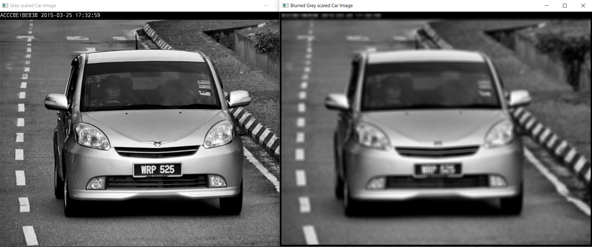
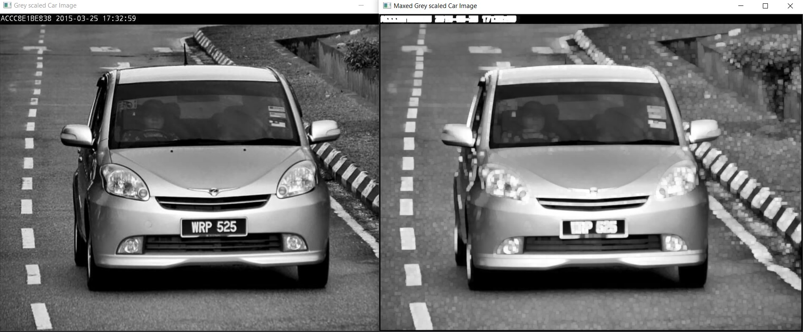
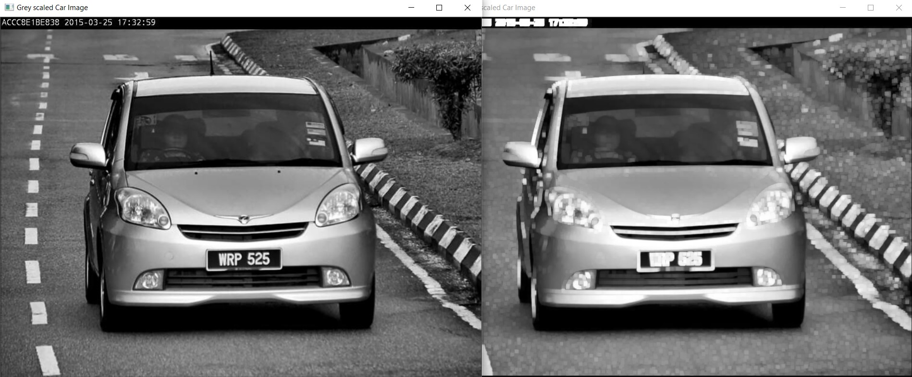

# Image Convolution

A very powerful tool for image preprocessing.

## Blur

Using the average kernel matrix we can blur the image. Here's a `9*9` average kernel:

A 9*9 kernel matrix looks at 4 neighbors. The higher the neighbors the more blurry the image will become as it blends with more neighbors.

## Max

The max kernel matrix will also blur an image focusing on the pixel with the highest values from the neighbors.

Here's an example looking at 2 neighbors (`5*5`):

## Mini

Likewise, the mini kernel matrix will blur focusing on a the lowest values among the neighbors

Here's an example looking at 2 neighbors (`5*5`):

