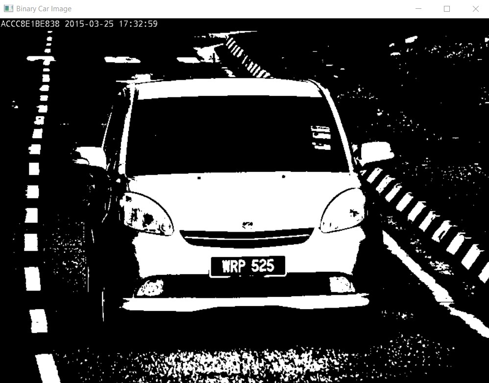

# RBG to grey scale to Binary

Defines two functions: one to convert any RGB image to grey scale, and another to convert a grey scale to a binary image.



## Functions

### RBG to Grey

```C++
Mat RBGtoGrey(Mat RGB){
 // Create a black grey scaled image
 Mat grey = Mat::zeros(RGB.size(), CV_8UC1);

 // For each row of the image
 for (int i = 0; i < RGB.rows; i++)
  // For every three values of the coloumn
  for (int j = 0; j < RGB.cols * 3; j += 3) {
   // Average the three RGB channels
   int grey_value = (RGB.at<uchar>(i, j) + RGB.at<uchar>(i, j + 1) + RGB.at<uchar>(i, j + 2)) / 3;
   // Assign them to the respective pixel
   grey.at<uchar>(i, j / 3) = grey_value;
  }

 return grey;
}
```

### Grey to Binary

```C++
Mat GreytoBinary(Mat Grey) {
 Mat Binary = Mat::zeros(Grey.size(), CV_8UC1);

 // For each row of the image
 for (int i = 0; i < Grey.rows; i++)
  // For every three values of the coloumn
  for (int j = 0; j < Grey.cols; j++)
   // Assign them to the respective pixel
   Binary.at<uchar>(i, j) = Grey.at<uchar>(i, j) >= 128? 255 : 0;
 
 return Binary;
}
```
