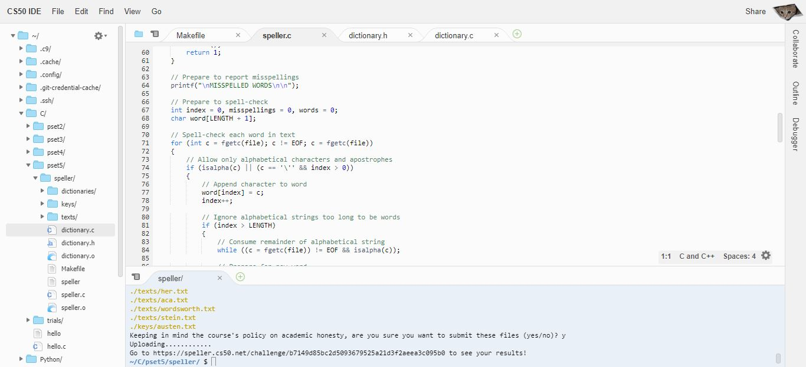

# C programming

this file includes an array of complex C programs that implements algorithms, and solve problems with high functionality. those programs will include, among other things, concepts like the following:

- command-line arguments.
- pointers.
- data structures (single and double linked lists, hash tables, and tries).
- dynamic and static memory allocation.
  
When developing my code as you will note: speed and efficiency are maximized!

## Listed by complexity

The following is a list of all the programs in this files that I developed listed by complexity:

1. **Speller**: Using the trie data structure this program loads a text file and a dictionary, dictionaries/large by default, and outputs all of the spelling mistakes along with the speed and time of execution.
1. **Recover**: retrieves deleted images from a camera card.
1. **Resize**: Resizes BMP files.
1. **TideMan**: Implements and handles a **rank-choice voting system**.
1. **Crack**: A program that brute forces a given hash, and returns the text used to generate the hash.
1. **WhoDunit**: Welcome to Tudor Mansion. Your host, Mr. John Boddy, has met an untimely end - he’s the victim of foul play. To win this game, you must determine whodunit.
1. **Plurality**: A program designed to handle plurality voting.
1. **Vigenere**: Takes in a plaintext and a keyword, and returns a ciphertext. for better understanding of this project check the [`Caesar project`](../Caesar).
1. **Caesar**: Takes in a plaintext and an integer and returns a ciphertext by rotating each character.
1. **Greedy Algorithm**: take a change as input and outputs the least number of coins to be returned.
1. **Mario**: Recreating the double pyramids in the mario game using # with a height specified by the user between 1 and 8 inclusive.
1. **Hello**: The beginning of every programmers journey.
