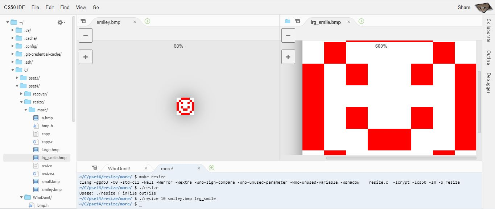

# Resize



Resizes BMP files.

## Usage

```bash
$ ./resize .25 large.bmp small.bmp
$
$ ./resize 4 small.bmp large.bmp
```

The program takes in three command-line arguments:

1. A float stating the ratio of the new image
2. The name of the bmp file to resize
3. the name of the bmp file to be produced

Note: the out-file doesn't need to exist before hand.

---

## BMP image files

> A file is just a sequence of bits, arranged in some fashion.

A 24-bit BMP file, then, is just a sequence of bits, (almost) every 24 of which represent some pixel’s color. Where every 8 represent the concentration of each of the RGB colors. In BMP file, however, the arrangement is reversed to BGR.

Since each is represented by 8 bits, or 1 byte, we can represent the number in 2 hexadecimal digits:

> 00 00 ff  -----> signifies red\
> 00 00 00   ----> signifies black\
> Ff ff ff  --------> signifies white

### Metadata

But a BMP file also contains some **"metadata"**, information like an image’s height and width. That metadata is stored at the beginning of the file in the form of two data structures generally referred to as **"headers"**.

- The first of these headers, called *BITMAPFILEHEADER*, is 14 bytes long.
- The second of these headers, called *BITMAPINFOHEADER*, is 40 bytes long.
  
The *BITMAPFILEHEADER* structure contains information about the type, size, and layout of a file that contains a DIB (device-independent bitmap).

The BITMAPINFOHEADER structure contains information about the dimensions and color format of a DIB. A 24-bit BMP’s first $14 + 40 = 54$ bytes are filled with metadata.

Immediately following these headers is the actual bitmap: an array of bytes, triples of which represent a pixel’s color. Some BMPs also store the entire bitmap backwards, with an image’s top row at the end of the BMP file.

### Padding

Each row (aka **"scanline"**), number_of_pixels * 3 (3 bytes per pixel), should be a multiple of 4. Otherwise the scanline is "padded" with as many zeroes as it takes to extend the scanline’s length to a multiple of 4.
