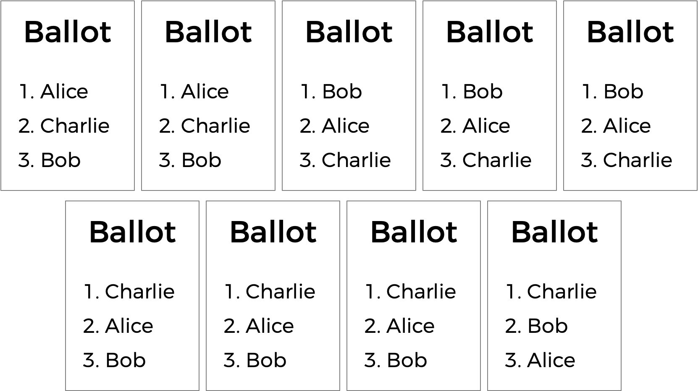

# TideMan


Implements and handles a **rank-choice voting system**.

## Usage

```BASH
$ ./tideman
Usage: tideman [candidate ...]
$ ./tideman A B C
Number of voters: 3
Rank 1: A
Rank 2: B
Rank 3: C

Rank 1: C
Rank 2: B
Rank 3: A

Rank 1: A
Rank 2: C
Rank 3: B

A
```

Takes in the names of candidates as command-line arguments separated by a space. The program prompts the user for the number of voters and then lets the user fill in the ranking per voter- printing out the winner(s) as output.

---

## ranked-choice system

In a ranked-choice system, voters can vote for more than one candidate. Instead of just voting for their top choice, they can rank the candidates in order of preference. The winner then is  the person who would have won any head-to-head matchup against another candidate- the so-called **“Condorcet winner”** of the election.


As ranked ballot-1.png shows an election that would have ended in tie between Alice and Bob will now end in Alice winning because the voter who voted for Charlie prefers her over Bob.



Generally speaking, the TideMan method works by constructing a “graph” of candidates, where an arrow (i.e. edge) from candidate A to candidate B indicates that candidate A wins against candidate B in a head-to-head matchup. the graph for condorcet.png is shown in condorcet-graph.png.


