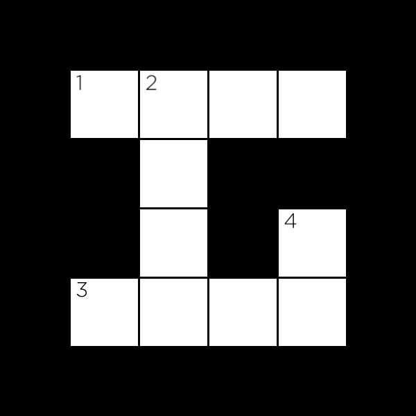

# Crossword

An AI that generates crossword puzzles. [watch it in action!](https://youtu.be/iuapVK6R4yg)


## Usage

```bash
$ python generate.py data/structure1.txt data/words1.txt output.png
██████████████
███████M████R█
█INTELLIGENCE█
█N█████N████S█
█F██LOGIC███O█
█E█████M████L█
█R███SEARCH█V█
███████X████E█
██████████████
```

Run `python generate.py` followed by two arguments: a structure file and a word file (following the format stated in [data](#data)).

## Table of content

- [Crossword](#crossword)
  - [Usage](#usage)
  - [Table of content](#table-of-content)
  - [Representation](#representation)
    - [The problem](#the-problem)
    - [Variables](#variables)
      - [**Unary constraints**](#unary-constraints)
      - [**Binary constraints**](#binary-constraints)
  - [Data](#data)
  - [Code](#code)
    - [crossword.py](#crosswordpy)
      - [**Variable class**](#variable-class)
      - [**Crossword class**](#crossword-class)
    - [generate.py](#generatepy)
  - [Acknowledgements](#acknowledgements)

----------

## Representation



### The problem

We can model this sort of problem as a **constraint satisfaction problem**. Where we have a predefined grid and we want to pick unique words that can fit each sequence of squares.

### Variables

Each sequence of squares is one variable that has four values:

1. starting row (`0` indexed counting from the top).
2. starting column (`0` indexed counting from the left).
3. direction of word (either `down` or `cross`).
4. the length of the word.

Variable 1, for example, would be a variable represented by a row of `1` , a column of `1`, a direction of `across`, and a length of `4`.

#### **Unary constraints**

The **unary constraint** on a variable is given by its length. For Variable 1, for instance, the word `BYTE` would satisfy the unary constraint, but the word `BIT` would not.

#### **Binary constraints**

The **binary constraints** on a variable are given by its overlap with neighboring variables. Variable 1 has a single neighbor: Variable 2. Variable 2 has two neighbors: Variable 1 and Variable 3.

For each pair of neighboring variables, those variables share an overlap: a single square that is common to them both. We can represent that overlap as the character index in each variable’s word that must be the same character.

For example, the overlap between Variable 1 and Variable 2 might be represented as the pair `(1, 0)`, meaning that Variable 1’s character at index `1` necessarily must be the same as Variable 2’s character at index `0`. The overlap between Variable 2 and Variable 3 would therefore be represented as the pair `(3, 1)`: character 3 of Variable 2’s value must be the same as character 1 of Variable 3’s value.

----------

## Data

The data folder contains a set of text files that can be classified as one of two categories:

1. A file that defines the grid.
   - the _ is used to represent blank cells, any other character represents cells that won’t be filled in.
2. A file that holds a list of word to fit into the grid.
   - one word per line.

----------

## Code

### [crossword.py](crossword.py)

This file defines two classes, Variable (to represent a variable in a crossword puzzle) and Crossword (to represent the puzzle itself).

#### **Variable class**

To create a Variable, we must specify four values: its row i, its column j, its direction (either the constant Variable.ACROSS or the constant Variable.DOWN), and its length.

#### **Crossword class**

Takes in the structure and word files and constructs a representation of a crossword grid. Each instance of the class has the following attributes:

- `crossword.height` is an integer representing the height of the crossword puzzle.
- `crossword.width` is an integer representing the width of the crossword puzzle.
- `crossword.structure` is a 2D list representing the structure of the puzzle.
  - For any valid row i and column j, `crossword.structure[i][j]` will be True if the cell is blank (a character must be filled there) and will be False otherwise (no character is to be filled in that cell).
- `crossword.words` is a set of all of the words to draw from when constructing the crossword puzzle.
- `crossword.variables` is a set of all of the variables in the puzzle (each is a Variable object).
- `crossword.overlaps` is a dictionary mapping a pair of variables to their overlap.
  - For any two distinct variables v1 and v2, crossword.overlaps[v1, v2] will be None if the two variables have no overlap, and will be a pair of integers (i, j) if the variables do overlap. The pair (i, j) should be interpreted to mean that the ith character of v1’s value must be the same as the jth character of v2’s value.

Crossword objects also support a method `neighbors` that returns all of the variables that overlap with a given variable.

### [generate.py](generate.py)

We define a class `CrosswordCreator` that we’ll use to solve the crossword puzzle. When a `CrosswordCreator` object is created, it gets a `crossword` property that should be a `Crossword` object. Each CrosswordCreator object also gets a domains property: a dictionary that maps variables to a set of possible words the variable might take on as a value. Initially, this set of words is all of the words in our vocabulary.

`print` will print to the terminal a representation of the crossword puzzle for a given assignment (every assignment, in this function and elsewhere, is a dictionary mapping variables to their corresponding words). `save`, meanwhile, will generate an image file corresponding to a given assignment. `letter_grid` is a helper function used by both print and save that generates a 2D list of all characters in their appropriate positions for a given assignment.

the `solve` function does three things:

1. first, it calls `enforce_node_consistency` to enforce node consistency on the crossword puzzle, ensuring that every value in a variable’s domain satisfy the unary constraints.
2. Next, the function calls `ac3` to enforce arc consistency, ensuring that binary constraints are satisfied.
3. Finally, the function calls `backtrack` on an initially empty assignment (the empty dictionary dict()) to try to calculate a solution to the problem. To speed up the process three heuristics were implemented when selecting an unassigned variable and domain value for that variable:
   1. Minimum Remaining Values (MRV).
   2. Degree heuristic.
   3. Least Constraining Values heuristic.

----------

## Acknowledgements

[crossword.py](crossword.py), along with the main function, and init, letter_grid, print, save, and solve methods of the CrosswordCreator class of [generate.py](generate.py) have been implemented by the CS50AI staff.
