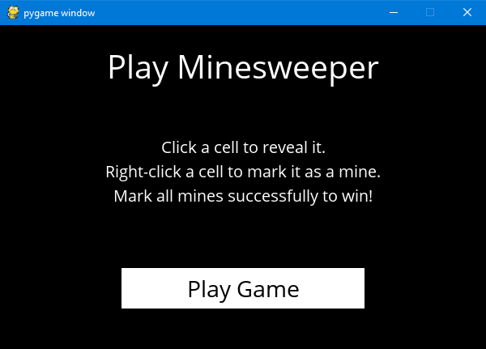
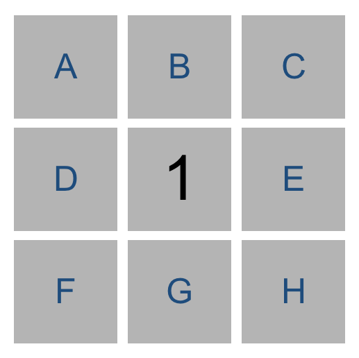
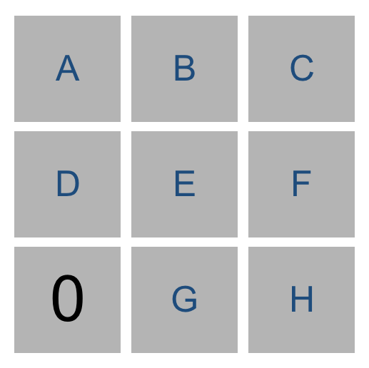
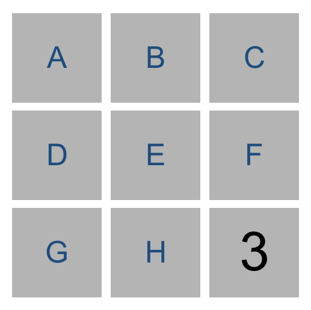
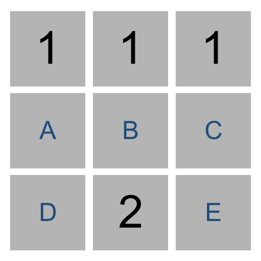

# MineSweeper


The minesweeper game with an implemented AI that can play the game. [Watch it in action!](https://youtu.be/tlMrZHnrZ_w)

## Usage

```bash
python runner.py
```

Run the following command to run the game and play, or let the AI play for you!

## Table of contents

- [MineSweeper](#minesweeper)
  - [Usage](#usage)
  - [Table of contents](#table-of-contents)
  - [Rules](#rules)
    - [Goal](#goal)
  - [Downsides of some approaches](#downsides-of-some-approaches)
    - [Propositional Logic](#propositional-logic)
    - [Model checking](#model-checking)
  - [Knowledge Representation](#knowledge-representation)
    - [inferring](#inferring)
    - [Drawing conclusions](#drawing-conclusions)
    - [Subsets](#subsets)
  - [Runner.py](#runnerpy)
  - [Minesweeper.py](#minesweeperpy)
    - [Minesweeper()](#minesweeper-1)
  - [Acknowledgements](#acknowledgements)

---

## Rules



If you have never played the game before here's how it works. This game is a puzzle game that consists of a grid of cells, where cells either contain hidden **"mines"** or are **safe** (i.e., does not contain a mine):

- If you click on a cell containing a mine then you lose the game.
- Clicking on a safe cell will show a number indicating how many neighboring cells[^1] contain mines.

[^1]: In this context, neighboring cells are cells that are adjacent to the left, right, up, down, or diagonal.

In this 3x3 Minesweeper game, for example, the three `1` values indicate that each of those cells has one neighboring cell that is a mine. The four `0` values indicate that each of those cells has no neighboring mine.


Given this information, a logical player could conclude that there must be a mine in the lower-right cell and that there is no mine in the upper-left cell, for only in that case would the numerical labels on each of the other cells be accurate.

### Goal

The goal of the game is to **flag** (i.e., identify) each of the mines. In many implementations of the game, including the one in this project, the player can flag a mine by right-clicking on a cell (or two-finger clicking, depending on the computer).

---

## Downsides of some approaches

### Propositional Logic

Using propositional logic to represent the knowledge won't suffice for this project. Let's say that our cells will hold a true vale of true if the cell has a mine. And Take the following 3x3 grid for example:



while you might expect us to represent the knowledge of that grid with the following syntax:

```python
# A ∨  B ∨  C ∨  D ∨  E ∨  F ∨  G ∨  H
Or(A, B, C, D, E, F, G, H)
```

But in actuality we know more than that. Not only we know that one of the labeled cells is a mine, we also know that the rest aren't. And representing this will make our sentences complex:

```python
"""
(A ∧ (¬B) ∧ (¬C) ∧ (¬D) ∧ (¬E) ∧ (¬F) ∧ (¬G) ∧ (¬H)) ∨
((¬A) ∧ B ∧ (¬C) ∧ (¬D) ∧ (¬E) ∧ (¬F) ∧ (¬G) ∧ (¬H)) ∨
((¬A) ∧ (¬B) ∧ C ∧ (¬D) ∧ (¬E) ∧ (¬F) ∧ (¬G) ∧ (¬H)) ∨
((¬A) ∧ (¬B) ∧ (¬C) ∧ D ∧ (¬E) ∧ (¬F) ∧ (¬G) ∧ (¬H)) ∨
((¬A) ∧ (¬B) ∧ (¬C) ∧ (¬D) ∧ E ∧ (¬F) ∧ (¬G) ∧ (¬H)) ∨
((¬A) ∧ (¬B) ∧ (¬C) ∧ (¬D) ∧ (¬E) ∧ F ∧ (¬G) ∧ (¬H)) ∨
((¬A) ∧ (¬B) ∧ (¬C) ∧ (¬D) ∧ (¬E) ∧ (¬F) ∧ G ∧ (¬H)) ∨
((¬A) ∧ (¬B) ∧ (¬C) ∧ (¬D) ∧ (¬E) ∧ (¬F) ∧ (¬G) ∧ H)
"""
Or(
    And(A, Not(B), Not(C), Not(D), Not(E), Not(F), Not(G), Not(H)),
    And(Not(A), B, Not(C), Not(D), Not(E), Not(F), Not(G), Not(H)),
    And(Not(A), Not(B), C, Not(D), Not(E), Not(F), Not(G), Not(H)),
    And(Not(A), Not(B), Not(C), D, Not(E), Not(F), Not(G), Not(H)),
    And(Not(A), Not(B), Not(C), Not(D), E, Not(F), Not(G), Not(H)),
    And(Not(A), Not(B), Not(C), Not(D), Not(E), F, Not(G), Not(H)),
    And(Not(A), Not(B), Not(C), Not(D), Not(E), Not(F), G, Not(H)),
    And(Not(A), Not(B), Not(C), Not(D), Not(E), Not(F), Not(G), H)
)
```

That’s quite a complicated expression! And that’s just to express what it means for a cell to have a 1 in it. If a cell has a 2 or 3 or some other value, the expression could be even longer.

### Model checking

Trying to perform model checking on this type of problem, too, would quickly become intractable: on an 8x8 grid, the size Microsoft uses for its Beginner level, we’d have 64 variables, and therefore $2^{64}$ possible models to check – far too many for a computer to compute in any reasonable amount of time.

## Knowledge Representation

A better way to represent our knowledge is the following:

```python
{A, B, C, D, E, F, G, H} = 1
```

Every logical sentence will have two parts:

- Set of `cells` on the board that are involved in the sentence.
- A number `count`, representing the count of how many of those cells are mines.

The above logical sentence says that out of cells A, B, C, D, E, F, G, and H, exactly 1 of them is a mine.

### inferring

To get a sense of why this method of representation is useful take the following grid:



Using the knowledge from the lower-left number, we could construct the sentence `{D, E, G} = 0` to mean that out of cells D, E, and G, exactly 0 of them are `mines`, i.e. we know that all of that sentence’s cells must be `safe`.

Similarly, consider the game below:



Our AI would construct the sentence `{E, F, H} = 3`. Intuitively, we can infer that all of E, F, and H are mines. More generally, any time the number of cells is equal to the count, we know that all of that sentence’s cells must be `mines`.

### Drawing conclusions

In general, we’ll only want our sentences to be about cells that are not yet known to be either safe or mines. This means that, once we know whether a cell is a mine or not, we can update our sentences to simplify them and potentially draw new conclusions.

For example, if our AI knew the sentence `{A, B, C} = 2`, we don’t yet have enough information to conclude anything. But if we were told that `C` were `safe`, we could remove `C` from the sentence altogether, leaving us with the sentence `{A, B} = 2` (which, incidentally, does let us draw some new conclusions.)

Likewise, if our AI knew the sentence `{A, B, C} = 2`, and we were told that `C` is a `mine`, we could remove `C` from the sentence and decrease the value of count (since `C` was a mine that contributed to that `count`), giving us the sentence `{A, B} = 1`. This is logical: if two out of `A`, `B`, and `C` are `mines`, and we know that `C` is a mine, then it must be the case that out of `A` and `B`, exactly one of them is a `mine`.

### Subsets



Consider just the two sentences our AI would know based on the top middle cell and the bottom middle cell. From the top middle cell, we have `{A, B, C} = 1`. From the bottom middle cell, we have `{A, B, C, D, E} = 2`. Logically, we could then infer a new piece of knowledge, that `{D, E} = 1`. After all, if two of `A`, `B`, `C`, `D`, and `E` are `mines`, and only one of `A`, `B`, and `C` are mines, then it stands to reason that exactly one of `D` and `E` must be the other `mine`.

More generally, any time we have two sentences `set1 = count1` and set2 = count2 where *set1 is a subset of set2*, then we can construct the new sentence `set2 - set1 = count2 - count1`.

---

## [Runner.py](runner.py)

Contains the code to build and handle the UI end of the game.

## [Minesweeper.py](minesweeper.py)

Contains all the logic of the game itself and for the AI to play the game. This file defines three classes:

1. `Minesweeper`, which handles the game play.
2. `Sentence`, which represents a logical sentence that contains both a set of `cells` and a `count`.
3. `MinesweeperAI`, which handles inferring which moves to make based on knowledge.

### Minesweeper()

The default dimensions of the board is an 8x8 grid. The broad is represented by an list that holds a number of lists each representing a curtain row.

```python
[
    [False, False, False, False, False, False, False, False],
    [False, False, False, True, False, False, False, False],
    [False, False, False, False, False, False, False, False],
    [False, False, False, False, False, False, False, False],
    [False, False, False, False, True, False, False, False],
    [False, True, True, False, False, False, False, False],
    [True, False, True, True, False, False, False, False],
    [False, False, False, False, False, False, False, True],
]
```

```python
"""
-----------------
| | | | | | | | |
-----------------
| | | |X| | | | |
-----------------
| | | | | | | | |
-----------------
-----------------
| | | | |X| | | |
-----------------
| |X|X| | | | | |
-----------------
|X| |X|X| | | | |
-----------------
| | | | | | | |X|
-----------------
"""
```

---

## Acknowledgements

[runner.py](runner.py), the Minesweeper class, the dunder methods of the Sentence class, and some methods of the MinesweeperAI class - __init__, mark_mine, and mark_safe - were all implemented by CS50AI.
