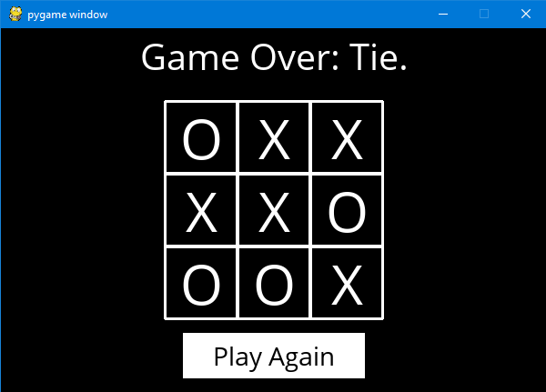

# Tic-Tac-Toe

A Tic-Tac-Toe GUI where players can play against an implemented AI, [Watch it in action!](https://youtu.be/2pN998DBFAk)



The purpose of this project is to construct an AI that plays Tic-Tac-Toe optimally using the **MiniMax Search algorithm** to determine the best move.

> You can compare this project to a one that i did at [middle school](https://github.com/Yahya-Saleh/Projects/tree/master/Python/Must%20Check%20Middle-school%20projects) ;)

## Usage

```bash
python runner.py
```

Run this command to play the game against an AI!

## Table of contents

- [Tic-Tac-Toe](#tic-tac-toe)
  - [Usage](#usage)
  - [Table of contents](#table-of-contents)
  - [Runner.py](#runnerpy)
  - [Tictactoe.py](#tictactoepy)
    - [Game Logic](#game-logic)
      - [Player](#player)
      - [Actions](#actions)
      - [Result](#result)
      - [Winner](#winner)
      - [Terminal](#terminal)
      - [Utility](#utility)
    - [Tic-Tac-Toe AI](#tic-tac-toe-ai)
      - [minimax](#minimax)
      - [max value](#max-value)
      - [mini value](#mini-value)
    - [Alpha-Beta pruning vs Depth](#alpha-beta-pruning-vs-depth)
  - [grid.py](#gridpy)
  - [Acknowledgements](#acknowledgements)

---

## [Runner.py](runner.py)


Run as main, Runner.py handle the graphical interface aspect of the program by using Tictactoe.py's game logic implementation.

## [Tictactoe.py](tictactoe.py)

Handles the game login for playing the game and implements the AI.

### Game Logic

The game is represented by a list containing three lists of size three each representing a row of the Tic-Tac-Toe board respectively.

```python
X = "X"
O = "O"
EMPTY = None

[
    [O, EMPTY, X],
    [O, X, EMPTY],
    [O, EMPTY, X]
]
```


#### Player

This function takes in a board state and returns player who has the next turn on a board. This function is used by runner.py to determine who's turn is it. The result function uses this function to determine which player is taking a given action.

#### Actions

Takes in a board state returns set of all possible actions (i, j) available on the board, where i is the row's index (0, 1, or 2) and j is the cell's index of the $i^{th}$ row (0, 1, or 2). The AI uses this function to know the possible moves of a given board state to evaluate them.

#### Result

Takes in a board state and an action, (i, j), and returns the resulting board state if the move is valid without altering the list holding the original board since the AI uses it. Using this function, the AI can know the result of the action to calculate its utility value if the game is at a terminal state.

#### Winner

Takes in a board state and returns the winner of the game, if there is one. runner.py and the utility function use this function to determine the winner in a terminal state.

#### Terminal

Takes in a board state and returns True if game is over, False otherwise. This function is used by runner.py to determine if the game ended.

#### Utility

Takes in a given board state and returns 1 if X has won the game, -1 if O has won, 0 otherwise. This function helps the AI evaluate the best move to take.

### Tic-Tac-Toe AI

Using the **MiniMax Algorithm** this AI can calculate the best move in any given state! This is accomplished by evaluating each possible move and determining which one will put the opposing player in a position where their best option will lead to a win or a tie for the AI.

> The reason this AI cannot lose is because it predicts who outcome of the whole game for each move available.

#### minimax

This function takes in a given board state and returns the best action to take, (i, j). If it is O's turn the function calls the mini_value function, and otherwise it will call the max_value function, and using both the algorithm that calculate the end game of any given move.

#### max value

This function takes in a board state and if that state is the terminal state it will return the utility value of it. If it is not a terminal state; however, the function generate all of the possible actions and determining the best action for X by predicting what the O player will do using the mini_value function.

#### mini value

Much like the max value function, this function will return the utility value of a terminal state, and will return the best action for O to take by predicting what X would do.

### Alpha-Beta pruning vs Depth

Our AI could have considered the depth of each move therefore, not only picking the best move but picking one that will end the game quicker. This will increase the calculation process, because even if the AI found the move that ensures victory it will to calculate all of the remaining for the possibility of finding a move that will win faster.

Instead of accounting for the depth, I decided to make my AI faster by implementing **Alpha-Beta pruning**. Since we know the best situation for a given player, winning, we can assign it a numeric value, like 1 for example, and tell our AI that if it found a move that has a utility value of 1 to return without examining the remaining possible moves.

```python
# Inside a loop
if actions_value[0] == 1:
    return best_action
```

## [grid.py](grid.py)

Has a function that draws a given board into the command-line. This file was used during the testing and implementation phases.

```bash
        None    |       X       |       None
----------------+---------------+----------------
        X       |       O       |       None
----------------+---------------+----------------
        None    |       O       |       X
```

---

## Acknowledgements

[runner.py](runner.py), and the initial_state function of [tictactoe.py](tictactoe.py) were provided by CS50AI.
