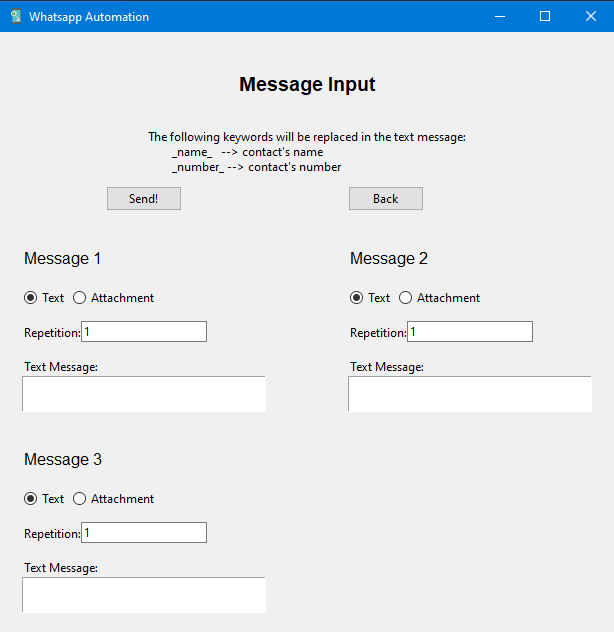

# WhatsApp Automation GUI

A python based Graphical user interface That sends specified text message or attachment to a given number(s). [Check the illustration!](https://youtu.be/NItektT6gao)

## Contacts processing

If an excel file is passed to the first input section the program extracts the names and numbers column filtering all null or invalid contacts and reporting the time it took to analyze and the invalid contacts found if any. If a number is passed, however, the user gets asked to enter that number's owner.


## Message

For each message the user picks between a text message or an attachment and how many times to repeat it, with some keywords available for text:

```text
The following keywords will be replaced in the message:
    _name_   --> contact's name
    _number_ --> contact's number
```

If the attachment file isn't found the user can skip through this message or renter the path. Note that the absolute path is generated by the program and is not necessarily needed.




## Automation

Using selenium and other modules, the program starts automatically sending the specified messages to each contact. This is achieved through opening and manipulating a web drive at an extremely high speed. If the WhatsApp database does not recognize a number that number is reported.

## Logging in

The first message would require the user to scan a QR code, but the program then stores this cache data so that the process doesn't have to be repeated. Any future execution would not require logging in because the system already stored the log in information.

## Reporting

After the process is completed, a report is generated which includes the time taken for contact processing, and by selenium as well as any failed attempts.


